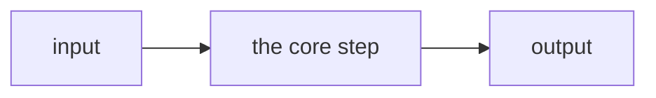

---
# ── Required ────────────────────────────────────────────────────────────────
# Short name shown on cards and in the filter. 1–2 words if possible.
title: "Project Name"
# Full/real name shown as the page heading. Can match title.
bodyTitle: "The Full Project Name"
# One sentence, ~15–25 words. Shown on the card. No trailing period needed.
summary: "What it does and what it is built with, in one line."
# Names in components/TechBadge.tsx `techIcons` get their logo; others get a generic code glyph.
technologies:
  - "TypeScript"
  - "Next.js"
# Sort position on the projects index (lower = earlier).
order: 99

# ── Optional ────────────────────────────────────────────────────────────────
# github: "https://github.com/hvenry/repo"
# live: "https://example.com"
# youtube: "https://youtu.be/..."          # any demo video (Loom works too)
# image: "project_name.png"                # public/assets/images/projects/, 1200x630 (OG size)
# imageLight: "project_name_light.png"     # optional light-mode variant, swaps with the theme
# draft: true                              # hidden in production, visible in dev
---

**TODO (Henry):** 1-3 short paragraphs on why you built it, the itch it scratched, and the interesting problem. Agents leave this for you.

## Project Name Overview

- What it does, in one line
- The core mechanism, in one line
- **Where it runs:** where it runs or is live

## How it works

One sentence of setup, then short bullets, one idea each:

- Rename this section to what it contains (`## The loop`, `## How the globe does its magic`)
- Use `###` for genuinely separate subsystems
- Tables for enumerable facts (specs, settings, options); one or two code blocks of ten lines max
- LaTeX (`$...$`, `$$...$$`) only when the formula is the point
- Link other writeups relatively: `[homelab](/projects/hvenrylab)`, never the full URL

## What I tried

- **First approach:** what happened, and why it was dropped
- **What replaced it:** why it held up, with a number if you measured it

## Where it stops and next steps

- What it does not do
- What the next version would need

**TODO (Henry):** a closing paragraph, no heading: where it came from, what it built on, credit to sources, how it feels to use.
