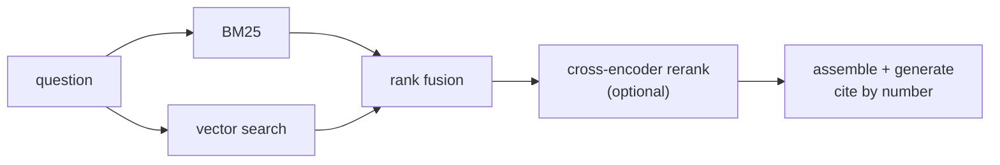

Most RAG apps show a spinner, then an answer (boring!).

In these scenarios, when the answer is wrong you cannot tell whether the retriever missed the passage or the model ignored it.

`clear-rag` makes retrieval **visible** (hence, clear - like what I did there?) as it runs and **measures** the effect of every technique in the pipeline.

## Clear RAG Overview

- clear-rag allows you to chat with your **own documents** and watch each retrieval stage rank the candidates before the answer streams in
- Keyword and vector search, **fused by rank**, optionally reranked by a cross-encoder, all passing one `Candidate` type
- The beautiful thing, **where it runs** - is on one machine against Ollama, with no credentials. _The ultimate clearness comes from self-hostable applications that you can run yourself! - me_



## How?

The retrieval core is written from primitives with minimal libraries (HTTP, SQLite, tensor math).

- **Ingestion:** content-hashed, and every chunk records its character span, which drives citation highlighting and evaluation
- **Keyword search:** [BM25](https://en.wikipedia.org/wiki/Okapi_BM25) from the formula over a hand-built inverted index, checked by a differential test against `SQLite FTS5`
- **Vector search:** exact cosine over L2-normalised vectors, one NumPy matrix-vector product
- **Fusion:** BM25 scores and cosine are **not comparable**, so Reciprocal Rank Fusion combines ranks only: $\sum_r 1 / (60 + \mathrm{rank}_r(d))$
- **Reranking:** `ms-marco-MiniLM-L-6-v2` (23 MB of int8 ONNX, on CPU) re-scores the fused list, off by default since it adds a few hundred milliseconds
- **Streaming:** Server-Sent Events carry a stage event per step ahead of the answer tokens, so the UI shows ranks moving

### One type through retrieval

```python
@dataclass(frozen=True)
class Candidate:
    chunk_id: str
    score: float
    rank: int
    source: str  # "bm25" | "dense" | "rrf" | "weighted" | "rerank"
    detail: dict[str, Any] = field(default_factory=dict)
```

- BM25, dense search, fusion and rerank all take and return `list[Candidate]`, so the UI draws rank flow between any two of them
- The other stages have their own shapes but emit the same stage record, so a new technique shows up for free
- The trace is a returned value, not a log: it persists to SQLite and evaluation scores it without re-invoking a model

## What I tried

Every technique is a row in an [ablation table](https://medium.com/@adnanmasood/ablation-studies-the-operating-system-for-trustworthy-ai-decisions-b99300d3bd32) over a 67-question golden set and a ten-document corpus, with nomic-embed-text.

| Configuration                    | recall@1  | recall@5 | MRR       | nDCG@5    |
| -------------------------------- | --------- | -------- | --------- | --------- |
| dense only, 50% overlap (2024)   | 0.589     | 0.903    | 0.708     | 0.765     |
| keyword only (BM25)              | 0.766     | 0.903    | 0.823     | 0.843     |
| hybrid + weighted fusion         | 0.782     | 0.968    | 0.866     | 0.900     |
| hybrid + RRF                     | 0.734     | 0.968    | 0.841     | 0.874     |
| **hybrid + RRF + cross-encoder** | **0.927** | 1.000    | **0.965** | **0.974** |

- **Dense-only retrieval (the 2024 design):** BM25 alone beats it on a corpus full of identifiers like `X-RateLimit-Remaining`
- **Weighted score fusion:** it actually beats RRF here on `recall@1`, `MRR` and `nDCG@5`
- **Why RRF stays the default:** min-max weights depend on each corpus's score distribution and need retuning, while ranks are always comparable
- **Cross-encoder reranking:** the largest single jump, lifting `recall@1` from `0.734` to `0.927` and recovering the two questions hybrid search missed in its top five
- **Multi-query expansion:** paraphrase `recall@5` rises from `0.778` to `1.000`, but `recall@1` drops from `0.734` to `0.653`
- **Why it is off:** it costs an LLM call per question, and behind the reranker it changes nothing at this corpus size
- **Trusting recall alone:** a one-page résumé in three chunks scored perfect recall, yet a `3B` model refused or cited the wrong section
- **Grading answers too:** a second suite scores grounding and citation precision with no judge model (`llama3.2` `0.333`, `qwen3.5:9b` `1.000`)
- **Hand-rolled PDF parser:** about `600` lines of `pdfplumber` geometry beat `docling` on `SEC 10-K` retrieval, but flat `pypdf` extraction **beat both**

A key takeaway this project taught me: if a results file cannot vouch for a number, I do not get to write it.

## Where it stops and next steps

- HyDE and self-correction are greyed-out knobs; the machinery does not exist yet
- The benchmark corpus is ten short documents (about a dozen chunks), so every search returns the whole corpus as its shortlist, `recall@5` saturates and an approximate vector index has nothing to save; a large-corpus suite is planned
- **Known limitation:** one person on one machine; no auth, no multi-user, no OCR for scanned PDFs - I would like to add these eventually

## Background

The successor to my 2024 [Local RAG System](https://github.com/hvenry/Local-RAG-System) (LangChain, FAISS).

The rebuild fixed three of its bugs: 1) a rewrite prompt that answered instead of rephrasing, 2) unnormalised query vectors, and 3) a quality score that rewarded copying the context.
