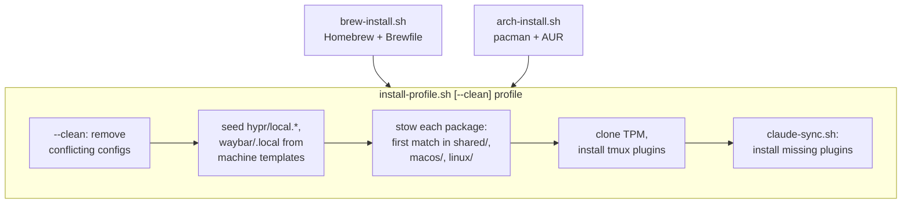

To start off, this is not a typical full stack project that I would normally showcase on my portfolio. I wanted to include it here since **I can confidently say** that `this is by far the most useful project to me`, and I strongly recommend that everyone should have their configuration files tracked.

Investing time in these practices will pay dividends throughout your engineering career. Well, _I can't personally guarantee that_ - but I have definitely felt that it has helped mine.

[Symlinking](https://en.wikipedia.org/wiki/Symbolic_link) a config file into place is a solved problem: [GNU Stow](https://www.gnu.org/software/stow/) does it in one command.

The tricky part is getting this configuration across multiple machines with different operating systems and use cases. For example, personally I have a personal and work MacBook Pro, a dual boot desktop PC that runs Arch & [Hyprland](https://hypr.land/), as well as headless servers, and my homelab. Each of these machines have different requirements but also share a lot of core configuration (since all are [Unix-like](https://en.wikipedia.org/wiki/Unix-like)).

## Dotfiles Overview

- A single command sets up a new machine or re-syncs an old one, **from 24 Stow packages** chosen by a per-machine profile
- **How it works:** the installer stows each package in the profile, then does what links cannot: machine-local files, tmux plugins, Claude Code plugins
- **Where it runs:** macOS, Arch Linux with Hyprland, and servers



## How it works

A profile is a plain list of package names with no platform prefix, so the installer resolves each one to whichever platform directory holds it.

| Profile         | Packages                                                                                               |
| --------------- | ------------------------------------------------------------------------------------------------------ |
| `macos`         | 12: zsh, nvim, tmux, ghostty, lazygit, lazydocker, vscode, aerospace, rectangle, herdr, claude, agents |
| `arch-hyprland` | 20: the core tools plus Hyprland, Waybar, Rofi, Mako, wlogout, Ly, GTK theming and more                |
| `server`        | 5: zsh, nvim, tmux, claude, agents                                                                     |

- **Layout:** each package lives under exactly one of `shared/` (10), `macos/` (2) or `linux/` (12)
- **No folding:** `.stowrc` sets `--no-folding`, so directories are real and only files are links; TPM clones plugins beside `tmux.conf` without writing into the repo
- **macOS bootstrap:** finds or installs Homebrew, runs `brew bundle` on the Brewfile, then applies the `macos` profile
- **Arch bootstrap:** installs 74 pacman and 10 AUR packages, runs the profile, then `post-install.sh` switches the display manager to Ly and enables a yay update timer
- **Per-machine monitors:** Hyprland loads a gitignored `local.lua` via `pcall(require, "local")`, seeded from a template matching the hostname, else laptop if a battery or laptop chassis is found, else desktop
- **Shared core:** Zsh, Neovim in Lua, tmux on a `ctrl+space` prefix and Ghostty; vim-tmux-navigator makes `ctrl+hjkl` cross Neovim splits and tmux panes

### Big Reward: one set of agent instructions

Updating my `CLAUDE.md` has started to become a regular part of my workflow, so instead of managing this per machine, I opted to migrate to an agent-agnostic `AGENTS.md` (for root as well as per repo). I have since seen a tremendous productivity gain from this, I no longer am re-inventing the wheel of _"use e2e testing"_ or _"lint, format, test"_ or _"DO NOT COMMIT FILES WITHOUT MY EXPLICIT CONSENT"_ per machine, per session. A huge time saver!

More formally:

- A single global `AGENTS.md` lives in the `agents` package; relative symlinks put it where Codex and opencode look, and Claude Code imports it from `~/.claude/CLAUDE.md`
- Hand-written skills stow to `~/.agents/skills/`; Claude Code only reads `~/.claude/skills/`, so each skill gets a relative symlink there too
- `settings.json` doubles as the plugin manifest, and `claude-sync.sh` skips the personal MCP plugins (Notion, Figma, Railway) unless a `~/.config/dotfiles/personal` marker exists, keeping them off work machines

The `CLAUDE.md` files that I use now are quite literally:

```
@AGENTS.md
```

## Things I tried while setting up the repo

- **A flat layout:** every package at the root was fine for one machine, but a Mac checkout then held Hyprland directories it would never use, so packages moved under platform directories
- **Stow's default folding:** one symlink per directory would have let TPM write plugins into the repo, so folding is off
- **Running the Arch bootstrap as root:** makepkg and yay refuse, so AUR steps drop to `$SUDO_USER` through a `run_as_user` helper
- **Unattended AUR installs:** `yay --noconfirm` cannot accept an unknown GPG key, so signing keys are imported before anything builds
- **Installing Homebrew blindly:** a fresh shell has brew on disk but not on `PATH`, so the script now probes `/opt/homebrew` and `/usr/local` first

## Where it stops and next steps

- Because of `--no-folding`, pulling a commit that adds a file creates no link for it until the installer runs again - I would eventually like to automate this
- VS Code and lazygit read `~/Library/Application Support/` on macOS, so their stowed configs go unused there
- Rectangle reads a plist, so the repo keeps an exported JSON snapshot that is re-exported by hand (I wish every app would just standardize on `.config/<app>`)
- No test suite or linter yet: a change is verified by running the installer for the affected profile

## Background and final remarks

This repo started in 2024 as a flat Stow repo and was eventually split into `shared/`, `macos/` and `linux/` once a second platform made the flat layout misleading.

This project now allows me to have my familiar keybinds, most used apps, and preset workflows available across all my machines. This is genuinely a life saver and I cannot stress enough how much of a time saver this has become through my day-to-day software engineering.
