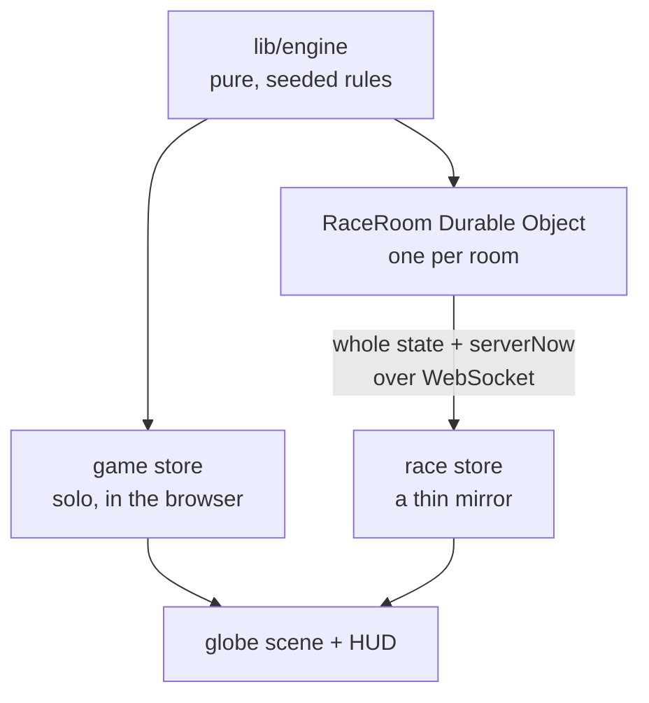
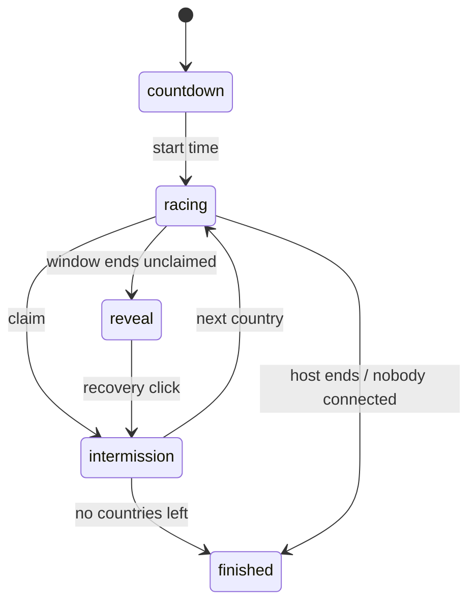

`globe.expert` is a modern take on a geography game where you find countries on a map. The modern take being it's **awesome** and **3D**.

Two real problems I had playing other map clicking games (like the smashing hit video game [Seterra](https://www.geoguessr.com/vgp/3069)) shaped it:

- country borders are flat polygons and a globe is a sphere
- a race needs one set of rules that the browser and a server both run and agree on

## globe.expert Overview

- `globe.expert` names a country, _and you find it_; this could be during solo runs, a quick Daily 20, or a 2-4 player race where the first correct click claims each country
- **How it works:** a pure, seeded rules engine runs unchanged in the browser for solo and in one `Cloudflare Durable Object` per race room
- **Where it runs:** live at [globe.expert](https://globe.expert) (site on Vercel, room servers on Cloudflare)

## How the globe does its magic

### One engine, two hosts

Every rule is a transition `(state, input, now) -> state` with no React, browser APIs or `Date`, so the same code bundles into the Worker.

- **No-ops by reference:** an action that changes nothing returns the same object, detected with `===`
- **Seeded:** the country order comes from a seeded shuffle, so the same seed and set always play the same countries in the same order
- **Wall-clock deadlines, not tick counters:** a throttled background tab cannot drift the clock, and pausing a solo run just shifts the deadline
- **One race clock:** `phaseDeadline` is the only time field; the room sleeps on a storage alarm until it, calls `tick`, broadcasts, and sleeps again
- **Late clicks:** `guess` applies every passed deadline before the click, so an oversleeping server, a slow network and a skewed client resolve the same way

### The race room

- **One object per room,** addressed by its room code, so there is no registry or sticky routing
- **Single-threaded,** so two simultaneous claims are serialised and the first processed wins, which is the tie-break the engine assumes
- **Server-authoritative:** clients only say "I clicked X"; they receive a public view that never contains the order or seed, since either names every upcoming country
- **Hiding lag:** each message carries `serverNow` so a skewed client corrects its timers, and **your own claim paints instantly**, lapsing after 1.5 s if the server ignores it
- **Rules:** the host picks a set, a count (5-250), seats (2-4), a window (5-30 s) and hints; a wrong click costs a 1.5 s lockout, not a try
- **Reveal:** an unclaimed country pulses with no deadline until someone clicks it, so the room always sees where it was

### Flat polygons on a sphere

**Natural Earth TopoJSON** is decoded to longitude and latitude rings, and each use needs its own conversion.

- **Fills** are not geometry: a d3 `geoPath` paints them on a `4096×2048` canvas that textures the sphere, using an [equirectangular projection](https://en.wikipedia.org/wiki/Equirectangular_projection) rotated a quarter turn, because its $(u, v)$ is exactly a sphere's UV parametrisation:

$$
u = \frac{1}{2} + \frac{\lambda - 90^\circ}{360^\circ}, \qquad v = \frac{1}{2} - \frac{\varphi}{180^\circ}
$$

- **Layers:** fills, hover and pulse are separate canvases, plus a land layer in the light theme, each repainting only when its own state changes
- **Borders and markers** are real 3D positions, and **clicks** run the map backwards from a ray hit on an invisible sphere; both directions live in one module
- **Picking** checks micro-state centroids first, then a bounding box, before any point-in-polygon test

## What I tried

- **Broadcasting the full race state:** every message carried the shuffled order and seed, so any client could read the next country early; players now get an explicit allowlist of fields
- **Shuffling a race Daily 20 with the day's seed:** it played in exactly today's public solo order; it now draws with the day's seed and shuffles with its own
- **Repainting the whole fill texture per broadcast:** cost grew from **15** to **133 ms** per country **(6x CPU throttle)**; repainting only changed regions holds it at **3-8 ms**
- **Full-canvas hover:** each hover uploaded **32 MB** to the GPU; a canvas cropped to the hovered country cut a mouse sweep from **3,087 MB** to **40 MB**
- **A browser-wide reconnect key:** a second tab took over the first tab's seat; the credential now lives in `sessionStorage`, per tab and per room

## Where it stops

- No server-side record of results, so the Daily 20 score lives on one device and there is no leaderboard
- Rooms are reached only by code or invite link, and idle rooms tear themselves down
- The light theme is unfinished and ships behind a build flag
- The Durable Object wiring is tested only by hand against `wrangler dev`

Once again, every geography game I had played was flat, a 2D map that felt like it was missing a dimension (literally), so I built one on a globe. Try it out at [globe.expert](https://globe.expert/) today!
