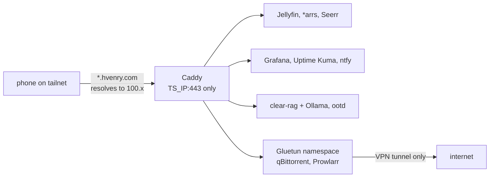

I recently (summer 2026) got into self-hosting software - `hvenrylab` was the result of that.

I had a pretty powerful Razer laptop kicking around, so I decided to repurpose it into a device that runs my media server, LLM inference via [Ollama](https://ollama.com/), and hosts a couple of my own apps (currently [clear-rag](/projects/clear-rag) & [OOTD](/projects/ootd)) as one Docker Compose project.

This was an interesting introduction to self-hosting, since this hardware was never meant to be a server, there is only one 8 GB GPU that is shared across all my services, and a literal laptop battery instead of a [UPS](https://en.wikipedia.org/wiki/Uninterruptible_power_supply).

## hvenrylab Overview

- Every service (OOTD, clear-rag, etc) gets `https://<name>.hvenry.com`, reachable only from devices on my tailnet
- If you are not on my tailnet, a [Cloudflare Single Redirect](https://developers.cloudflare.com/rules/url-forwarding/single-redirects/) sends `hvenry.com` to `henryvendittelli.com`
- Caddy binds only the Tailscale address and holds one wildcard certificate issued over DNS-01; downloads run inside a VPN namespace that fails closed



## The Machine

| Hardware    | Spec                                                                                                                       |
| ----------- | -------------------------------------------------------------------------------------------------------------------------- |
| Machine     | Razer Blade 15 Base Model (Early 2021), RZ09-0369                                                                          |
| CPU         | Intel Core i7-10750H, 6 cores / 12 threads, up to 5.0 GHz                                                                  |
| GPU         | NVIDIA GeForce RTX 3070 Laptop GPU, 8 GB VRAM                                                                              |
| RAM         | 64 GB (62 GiB usable)                                                                                                      |
| System disk | Samsung PM981a 512 GB NVMe (Arch)                                                                                          |
| Data disk   | Samsung 990 PRO 2 TB NVMe: a 1.3 TB btrfs partition for media and backups (about half used), sharing the disk with Windows |
| Network     | WiFi; [Tailscale](https://tailscale.com/) is the only way in                                                               |
| Power       | Built-in battery used as a UPS, at about 90% of design capacity, with a graceful shutdown when it runs low                 |

| Software   | Detail                                                                    |
| ---------- | ------------------------------------------------------------------------- |
| OS         | Arch Linux, LTS kernel (6.18), running headless with the lid closed       |
| GPU driver | nvidia-open-dkms 615 with the NVIDIA Container Toolkit                    |
| Runtime    | Docker 29 with Compose, 23 containers                                     |
| Access     | Tailscale, plus Caddy serving one wildcard certificate for `*.hvenry.com` |

## Private by construction

Each rule here is enforced by config, not by remembering it.

- **No public ports:** `*.hvenry.com` is a **DNS-only record** pointing at the machine's Tailscale IP, so it resolves for anyone and redirects when off the tailnet
- **One certificate:** Caddy gets a wildcard cert over `ACME DNS-01` against Cloudflare, so nothing has to be publicly reachable to issue it, and service names stay out of Certificate Transparency logs
- **Never `0.0.0.0`:** Docker's iptables rules sit ahead of ufw, so a published port bypasses the firewall. Services publish `127.0.0.1` only and Caddy alone binds the Tailscale address
- **No Docker socket anywhere:** it is root on the host. Homepage, Prometheus and Diun all run without it, at the cost of per-container metrics
- **Fail-closed downloads:** qBittorrent, Prowlarr and FlareSolverr use `network_mode: "service:gluetun"`, so the tunnel is the only interface they have. If Gluetun has no credentials it exits and they never start

## One portable 3070, three GPU tenants

| Tenant   | Uses the 3070 for                                                                                           |
| -------- | ----------------------------------------------------------------------------------------------------------- |
| Jellyfin | NVENC transcoding, so several streams barely touch the CPU                                                  |
| Ollama   | `qwen2.5:7b` (5.1 GB) and `nomic-embed-text` for [clear-rag](/projects/clear-rag) over this repo's own docs |
| ootd     | BiRefNet cutouts in under a second, against ~35 s on the CPU (huge!)                                        |

- Ollama keeps models loaded for 2 minutes rather than 30: idle VRAM blocks the other tenants and is idle draw on battery
- `OLLAMA_MAX_LOADED_MODELS=2`, because every query embeds before it generates and a limit of 1 thrashes the chat model in and out

## What I tried

- **Tailscale Serve alone:** its certificates cover the machine name only, so every service needed its own port. A wildcard on a real domain fixed that
- **Keycloak and oauth2-proxy for SSO:** being the IAM person I am today, of course I tried this. However it was removed once it was clear nothing routed through them. Forward auth is only as strong as the network behind it
- **node-exporter on the bridge network:** `/proc/net` is per namespace, so it reported Docker bridge traffic and the WiFi throughput appeared nowhere. It now runs on host networking, bound to the bridge gateway
- **`llama3.2` (3B) for RAG:** under the grounded prompt it answered with a bare `[3]` while retrieval was healthy. `qwen2.5:7b` answers and still refuses out-of-corpus questions

## Where it ends and next steps

- Backups are nightly restic snapshots (with a `pg_dump` for Postgres) to a second disk in the same laptop, so they survive a dead system disk but not theft or fire. Off-site is next!!
- [NAS](https://en.wikipedia.org/wiki/Network-attached_storage)
- No per-container metrics and no Grafana alerting yet, both planned without the Docker socket
- ExpressVPN has no port forwarding

This all started as a media stack and grew into the place my own software runs once I realized my MacBook was slowing down on some heavier projects.

When a project starts to slow down my Mac, it feels pretty great to push the latest code to git, run

```bash
ssh hvenry@hvenrylab
```

Authenticate with Tailscale, clone down the repo on that machine, and run the project on some beefier hardware (this was super useful when working on apps that relied on some local AI - `clear-rag` & `ootd` being biggest winners).

Also, having my [dotfiles](/projects/dotfiles) synced on `hvenrylab` lets me continue my workflows seamlessly. Wish I did this all earlier!
