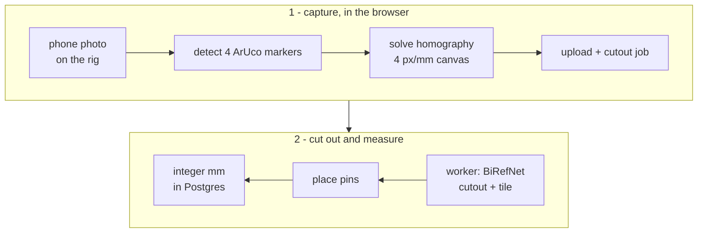

`OOTD` is my solution for owning too many clothes.

[Decision Fatigue](https://en.wikipedia.org/wiki/Decision_fatigue) and [Cognitive Load](https://en.wikipedia.org/wiki/Cognitive_load) are things that I experience every day when looking at my vast closet. (_Note to reader: I am a textbook software guy, but I can't neglect the 1/4 of my undergrad dedicated to my [cognitive science](/about) specialization._) Okay, maybe I am also a textbook fashion guy - it's just not my strong suit (see what I did there?).

Moving on... I enjoy thrifting, I like to collect random items, and more often than not that leads to me collecting interesting vintage clothing pieces. Frequently I cull and limit the amount of items in my wardrobe, but I am also (weirdly) sentimental about the clothing I collect. I always make a point when I am travelling anywhere, whether it be to a new town in Ontario or across the globe to check out some second-hand stores and pick up something that I like, so letting go is not always easy.

OOTD solves this fatigue of managing this closet by creating a digital archive of everything I own / have owned. Also, having all of this data of my wardrobe has led to some developments that I never thought I needed, like

- Daily outfit curation!
- A complete inventory of all my garment measurements
- Easy ability to reference my current closet before taking another garment under my wing (a game changer, I am now capped at 4 grey hoodies)
- Metrics! My most popular outfits, combos, and analytics on when I wear what
- AI!!!!! In this case, using an image model to take the reference cutouts, pinned measurements, and my approximate measurements as input to get some pretty accurate renderings of what things would look like on me

## OOTD Overview

- Creates a digital closet of cut-out garments, each with its dimensions (pit to pit, sleeve, inseam, rise) stored as integer millimetres
- `ArUco` markers at known spans give a homography per photo, and the pins I place on the garment are pushed through it into millimetres
- All completely self-hostable through one Docker Compose file; I run this on my [homelab](/projects/hvenrylab) since the cutouts powered by `BiRefNet` require a bit of horsepower. I talk more about the **30x** time reduction in my homelab writeup.

## From a phone photo to millimetres

Four printed `ArUco` pages are taped to the floor about 800 mm apart, and the garment lies flat inside them. You measure and set the actual distances in the app config.

- The browser detects the markers with `js-aruco2` (classical CV, no model) and picks the layout from the marker IDs in frame
- A hand-written solve maps the four marker centres to a 4 px/mm metric plane: eight unknowns, two equations per point, Gaussian elimination
- The photo uploads with its matrix, so it keeps the scale it was solved with even if the rig is later re-measured
- Measuring transforms the **tap coordinates**, never a warped image, so nothing is resampled twice

$$
\begin{bmatrix} u \\ v \\ w \end{bmatrix} = H \begin{bmatrix} x \\ y \\ 1 \end{bmatrix}, \qquad (x_{mm}, y_{mm}) = \tfrac{1}{4}\left(\tfrac{u}{w}, \tfrac{v}{w}\right)
$$

Accuracy is about 1 to 3 mm over 50 cm, limited by how flat the garment lies rather than by the maths.

### Cutouts and pins

- A Python worker claims jobs from a Postgres table with `FOR UPDATE SKIP LOCKED`, so the app and the worker share a queue with no broker
- **BiRefNet (MIT)** cuts each garment out: **under a second** on the homelab's RTX 3070, about 35 s on a CPU, a background job either way
- The rig decides which mask pieces are the garment, dropping a foot or a bag at the frame's edge while keeping a sleeve laid wider than the markers
- Pins are seeded from the mask (the armpit is where the outline, read up from the hem, leaps out at the sleeve) and then placed by hand, with a 2x loupe while held

## What I tried

- **A credit card for scale:** an 85.6 mm card scaling a 530 mm chest is about 11 mm out on a perfect tap, so markers spanning wider than the garment replaced it
- **Automatic landmarking:** about ±2 cm, useless for fit, so a person places each pin once and the homography makes it exact
- **Chroma key cutouts:** instant and model-free, but fails on a dark garment on a dark floor; it stays as a fallback provider
- **Popular segmentation weights:** RMBG-2.0 and rembg's default session are CC BY-NC. The repo is MIT and might become a paid service, so every model is checked against a licence list first

## In progress: the standard images with fal

Cutouts are true to shape, but every tile is a different silhouette.

The next step re-renders each garment onto one frozen mannequin plate with a hosted image-editing model through fal.ai, so the grid reads like a proper catalogue.

- **Why not local:** the licence-clean editing models need about 12 GB, and the 3070 has 8 GB ([see detailed breakdown on why here](https://youtu.be/ZxXMMJHqyss?si=MdTqUCHmk8ieiplM))
- Five candidates (GPT Image 2, Nano Banana Pro and 2, FLUX.2 pro, Seedream 5.0) are lined up for a bake-off of about 400 images on ten garments chosen to fail (print, stripes, dark knit, creased linen)
- Images never carry the fit claim: each output is **re-measured** against the stored millimetres, checked for colour drift in OKLab and for the mannequin itself moving, and flagged past tolerance
