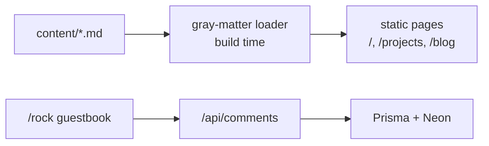
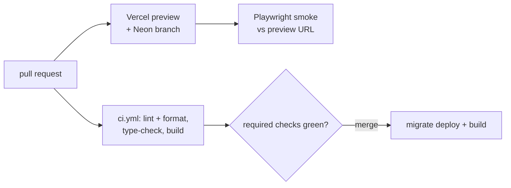

Hello!

This is my portfolio portfolio project writeup, pretty meta.

## My portfolio Overview

- My portfolio, with thoughts and project writeups like this one, plus a small `/rock` guestbook (if you are here you might as well check it out)
- Takes markdown in `content/` prerendered into static pages, themed by CSS variables, so almost nothing depends on hydration - since this is just under `content` you could see all the revision history of these writeups in the GitHub repo
- **Where it runs:** live on Vercel at henryvendittelli.com

## How it works

- **Design tokens:** no component names a colour; `--foreground`, `--line`, `--nav-dim` and friends live on `:root` (dark) and are overridden under `[data-theme="light"]`
- **Content as files:** the filename is the slug, `order` sorts the index, and `draft: true` shows only in `pnpm dev`
- **Rendering:** one server component handles `GFM`, `KaTeX`, and highlighted code; `Mermaid` (~3MB) is imported inside an effect, so it never enters the initial bundle

### Release pipeline

This is something that I wanted to make sure I had right for this project, deployments being as easy as possible let me keep this portfolio fresh and up to date.

- Branch protection on `main` requires `lint`, `type-check`, and `build`; the smoke suite runs on every preview but is not a required check
- Each preview gets a **copy-on-write Neon branch** and Clerk's development instance, so tests never touch production data or mint real sessions
- CI builds with a dummy `DATABASE_URL`, so the build is guaranteed database-free

## Take a look around

Every page on the site, and how `next build` renders it.

| Route                                        | What is there                      | Build             |
| -------------------------------------------- | ---------------------------------- | ----------------- |
| [`/`](/)                                     | Intro, experience and skills       | `○` static        |
| [`/projects`](/projects)                     | Every writeup, filterable by tech  | `○` static        |
| [`/projects/portfolio`](/projects/portfolio) | You are here                       | `●` per writeup   |
| [`/blog`](/blog)                             | Thoughts and tutorials             | `●` per post      |
| [`/about`](/about)                           | Education and clubs                | `○` static        |
| [`/random`](/random)                         | Setup, configs, software, books    | `○` static        |
| [`/reach-out`](/reach-out)                   | Contact info and resume            | `○` static        |
| [`/rock`](/rock)                             | A spinning 3D rock and a guestbook | `ƒ` live comments |
