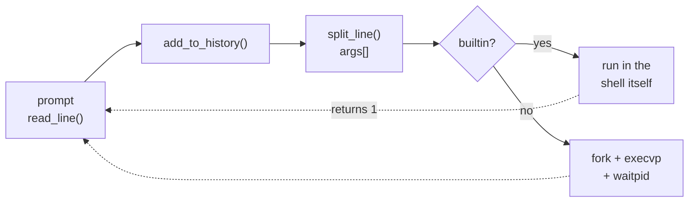
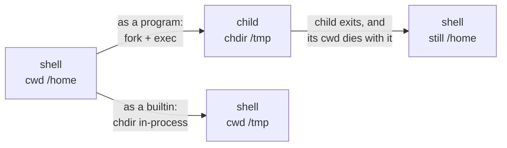

All terminal sessions run the same loop: print a prompt, read a line, split it into words, turn those words into a running process, wait, repeat.

I wrote this shell in C to see that loop with nothing on top of it - about 320 lines, no libraries beyond libc. Why? I was taking a course on systems-level programming ([CISC 220 at Queen's University](https://www.cs.queensu.ca/undergraduate/courses/CISC-220)) and while the programming was making sense (bash and C), I did not really understand the system. So I built the minimal, _simple_, version of it!

## Simple C Shell Overview

- `simple-c-shell` runs any program on `PATH`, plus the builtins `cd`, `help`, `exit` and `history`
- The core of it is a read-parse-execute loop that checks a builtin table first, then falls back to `fork`, `execvp` and `waitpid`

## How it works

`main` calls one loop that repeats until a builtin returns 0.

- **Read:** `read_line()` pulls characters with `getchar` into a heap buffer that grows in 1024-byte steps, stopping at newline or EOF
- **Parse:** `split_line()` runs `strtok` over the line, splitting on whitespace into a NULL-terminated `args` array that grows in 64-pointer steps
  - **One detail took me a while to appreciate:** `strtok` copies nothing; it writes null bytes into the line and returns pointers into it, so `args` owns no strings and both buffers are freed together at the bottom of the loop
- **Execute:** an empty line is skipped, a name found in the builtin table runs in-process, and anything else goes to `launch()`
- **Launch:** `fork()` returns twice (0 in the child, the child's PID in the parent); the child calls `execvp`, which only returns on failure, and the parent loops on `waitpid` until the child exits or is killed by a signal

### Why `cd` can't be a program

Another thing this project taught me falls straight out of that last step:

- A child gets a copy of the working directory, so a forked `cd` changes it and the change vanishes when the child exits
- `exit` has to stop the parent's loop, and `history` reads memory a child cannot see, so all four run inside the shell
- That is why the builtin table is checked before `fork` is ever called
- The table is two index-aligned arrays, `builtin_str[]` of names and `builtin_func[]` of function pointers, which is how C does dispatch without objects

## What I tried

- **`getchar` instead of `getline`:** kept to show manual buffer growth; `getline` would be shorter and is the obvious swap
- **History as a fixed array:** 100 `strdup`'d lines; when full it frees the oldest and shifts the rest down, O(n) per insert but trivial to read
- **Recording history before parsing:** simple, but it means blank lines land in history too, and numbering restarts at 1 once the buffer wraps
- **One file per builtin:** split out behind a shared header, but registering one still touches four places: `builtin.h`, the new `.c` file, the table in `help.c`, and the `Makefile`

## Where it stops (it's a fair amount)

- **Whitespace is the only syntax:** no quoting, `$VAR`, globbing, pipes or redirection, so `echo "a b"` passes `"a` and `b"`
- **No signal handling:** the shell installs no SIGINT handler, so Ctrl-C kills the shell itself; a stopped child (Ctrl-Z) leaves the wait loop waiting and hangs the prompt
- **Rough edges:** EOF (Ctrl-D or piped input) loops forever printing the prompt, child exit status is discarded (no `$?`), and `cd` with no argument errors instead of going to `$HOME`
- **Next:** a drafted spec adds unit and end-to-end tests, strict warnings, sanitizers and CI on Linux and macOS, and fixes the EOF loop; new shell features stay out of scope

This project was built from Stephen Brennan's [lsh walkthrough](https://brennan.io/2015/01/16/write-a-shell-in-c/), then extended with the `history` builtin and split into per-builtin translation units.
