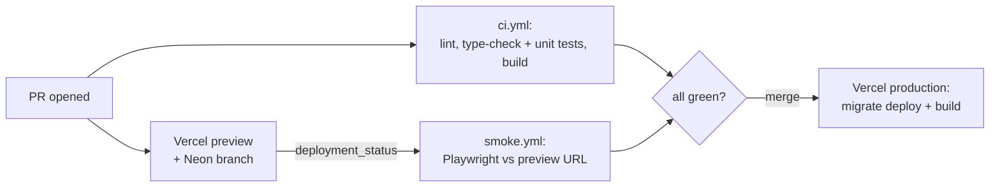

# CI/CD

GitHub Actions gates every pull request, Vercel deploys a preview per PR and production on merge to `main`.

## Why

`main` is production.
Nothing reaches it without passing lint, types, formatting, unit tests, a production build, and a smoke test against a real deployed preview.

## How it works

- `ci.yml` runs on every PR and push to `main`: three parallel jobs (`lint` + format check, `type-check` + unit tests, `build`).
- `smoke.yml` runs on Vercel's `deployment_status` event when a Preview deploy succeeds, checks out that commit, and runs Playwright against the preview URL.
- Branch protection on `main` requires the `lint`, `type-check`, and `build` checks.
  `smoke` runs on every preview but is not a required check.
- Vercel's git integration does all deploys; Actions only gates.

### Smoke suite

- Every top-level route returns 200 with a `henryvendittelli` title.
- A project detail page and a blog post (or the empty state) render.
- Navbar navigation and the theme toggle work.
- `/rock` shows the sign-in state for anonymous visitors, and reports Clerk init failures by name.

Run locally with `pnpm test:e2e` against `pnpm dev` on :3000, or set `BASE_URL`.

## Tech

- GitHub Actions (Node, pnpm, frozen lockfile)
- Playwright (Chromium)
- Vercel git integration and Deployment Protection
- Neon x Vercel integration

## Key files

- `.github/workflows/ci.yml` - lint, format, type-check, unit tests, build
- `.github/workflows/smoke.yml` - Playwright against the preview
- `playwright.config.ts` - base URL, retries, bypass storage state
- `e2e/global-setup.ts` - Vercel protection bypass cookie
- `e2e/smoke.spec.ts` - smoke tests

## Decisions and gotchas

- Previews sit behind Vercel Deployment Protection.
  Global setup trades `VERCEL_AUTOMATION_BYPASS_SECRET` for a cookie, because sending it as a header would trigger failing CORS preflights to Clerk's CDN.
- `type-check` runs `next typegen` first; route types must exist before `tsc`.
- The CI build uses a dummy `DATABASE_URL`, so the build must stay database-free.
- Renaming the `clear-rag` project or removing the theme toggle's `aria-label` breaks the smoke suite.

## Related

- [Database](database.md)
- [Guestbook](guestbook.md)
