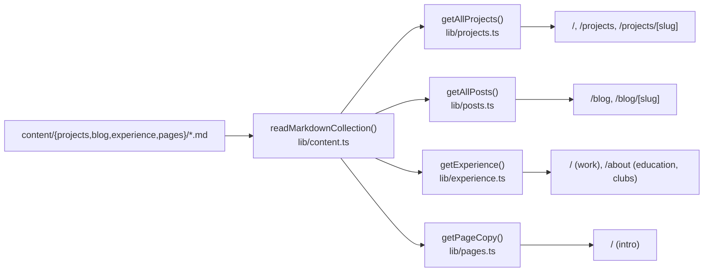

# Content system

Projects, blog posts, experience cards and page copy are markdown files in `content/`, loaded at build time and prerendered as static pages.

## Why

Writing a project or post should mean adding one file, not touching components.
Every content page is static, so the site needs no database or CMS to serve it.

## How it works

- `readMarkdownCollection()` reads every `.md` file in `content/<collection>`.
- The filename (minus `.md`) is the slug and the public URL.
- Files starting with `_` are templates and are skipped.
- `draft: true` hides a file in production builds; it still shows in `pnpm dev`.
- `getAllProjects()` and `getAllPosts()` normalise frontmatter into typed objects and are wrapped in React `cache()`.
- Lookups (`getProjectBySlug`, `getPostBySlug`) search the cached list, so no request reads a file by user-supplied path.
- Both `[slug]` routes use `generateStaticParams` and `dynamicParams = false`: unknown slugs 404 without rendering.

### Projects

- Sorted by `order` (lower first); a missing `order` sorts last.
- Cards receive a `ProjectSummary` (via `toProjectSummary`), never the full body, to keep client payloads small.
- Frontmatter reference and the writeup shape: `content/projects/_TEMPLATE.md`.
- Images go in `public/assets/images/projects/` at 1200x630; `imageLight` is an optional light-theme variant.

### Experience

- One file per role in `content/experience/`, rendered by `ExperienceCard` on `/` (work) and `/about` (education, clubs).
- Fields, in the leading Field/Value table (see below): `section` (`work`, `education` or `club`), `organization`, `role`, `period` (display text, wrapped in `[ ]`), `order`, `link`, `image`; optional `extra` (kept, not rendered) and `draft`.
- The body is the description; the card renders it as one paragraph, so line breaks become spaces.
- Sorted by `order` within a section; cards with the same `organization` group under one header with a timeline, so keep an organization's roles adjacent in `order`.
- Descriptions follow the XYZ format: what was accomplished, the result, and the skills used. Reference: `content/experience/_TEMPLATE.md`.
- These files are also edited from my Obsidian vault through a symlink, so a vault edit shows up as a change in this repo.

### Page copy

- One file per page in `content/pages/`; `home-intro.md` is the intro on `/`.
- The `tagline` field (Field/Value table) is the line beside the headshot; the body is markdown rendered with `ReactMarkdown`, one `body-copy` paragraph per paragraph, links styled `link`.
- `getPageCopy(slug)` throws when the file is missing, so renaming or deleting it fails the build.
- Edited from my Obsidian vault through the same symlink setup as experience cards.

### Blog

- Frontmatter: `title`, `date`, `description`, `tags`, optional `draft`.
- Sorted by `date`, newest first.
- Each post gets its own `<title>` and description from frontmatter.

### Static content

Everything that is not a collection lives in `data/index.ts`: `navItems`, `contact`, `setup`, `workflow`.
Company and school icons resolve through `getIconPath()` to `public/assets/images/icons/<name>.png`.

## Tech

- `gray-matter` for frontmatter
- React `cache()` for per-build memoisation

## Key files

- `lib/content.ts` - shared loader: read, skip templates, parse, hide drafts
- `lib/projects.ts` - `Project` / `ProjectSummary` types and project queries
- `lib/posts.ts` - `Post` type and post queries
- `lib/experience.ts` - `Experience` type and `getExperience(section)`
- `lib/pages.ts` - `getPageCopy(slug)` for `content/pages/`
- `lib/images.ts` - icon and project image paths
- `components/ProjectCard.tsx` - project tile on the index
- `components/ProjectLinks.tsx` - GitHub / YouTube / live links, shared by tiles and detail pages
- `data/index.ts` - static site content
- `app/projects/[slug]/page.tsx`, `app/blog/[slug]/page.tsx` - detail routes
- `content/projects/_TEMPLATE.md` - project frontmatter and writeup template
- `content/experience/_TEMPLATE.md` - experience card fields and the XYZ description rule
- `lib/fieldTable.ts` - `parseFieldTable()`, the Field/Value table parser (tests in `lib/fieldTable.test.ts`)

## Decisions and gotchas

- Experience cards and page copy keep their fields in a `| Field | Value |` table at the top of the body instead of frontmatter, because the Obsidian vault that edits them hides frontmatter. `readMarkdownCollection(collection, { fieldTable: true })` parses the table, removes it from `content`, and lets its values override any frontmatter. Only a table headed exactly Field and Value counts; numbers and `true`/`false` are coerced; write a literal pipe as `\|`.
- Frontmatter is not validated; every field may be missing, so the loaders default each one.
- Renaming a file changes its public URL.
- The e2e suite clicks into `/projects/clear-rag` and expects a heading named `clear-rag`; renaming that project breaks the smoke test.
- Project and blog text renders as site content: no em dashes.

## Related

- [Markdown rendering](markdown-rendering.md)
- [Tech filter](tech-filter.md)
