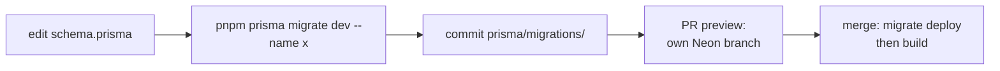

# Database

A Neon PostgreSQL database, accessed through Prisma, that stores guestbook comments and nothing else.

## Why

The guestbook needs durable, shared state; everything else on the site is static.
Committed migrations make schema changes reviewable and repeatable across preview and production databases.

## How it works

- One model: `Comment` (`id`, unique `userId`, `name`, `profileUrl`, `content`, `createdAt`).
- `lib/db.ts` exports a single `PrismaClient`, cached on `global` in development so hot reloads do not exhaust connections.
- `pnpm install` and `pnpm build` both run `prisma generate`; neither touches the database.
- Vercel's build command (set in the Vercel project settings, not in the repo) is `pnpm prisma migrate deploy && pnpm build`.
- The Neon x Vercel integration gives each PR preview a copy-on-write branch of the database, so previews never touch production data.

### Changing the schema

1. Edit `prisma/schema.prisma`.
2. Run `pnpm prisma migrate dev --name <name>` (creates and applies the migration, regenerates the client).
3. Commit the new folder under `prisma/migrations/`.
4. Merge; production runs `migrate deploy` before building.

## Tech

- Prisma (`prisma`, `@prisma/client`)
- PostgreSQL on Neon
- Neon x Vercel integration

## Key files

- `prisma/schema.prisma` - datasource and `Comment` model
- `prisma/migrations/` - `0_init` baseline and later migrations
- `lib/db.ts` - Prisma client singleton
- `.env.example` - `DATABASE_URL` shape

## Decisions and gotchas

- Import `prisma` from `lib/db.ts`; never create another `PrismaClient`.
- CI builds with a dummy `DATABASE_URL`; a build that needs a real database is a bug.
- `0_init` is a baseline of the schema that existed before migrations; never edit it.
- Schema changes moved from `prisma db push` to migrations; do not use `db push` against a shared database.

## Related

- [Guestbook](guestbook.md)
- [CI/CD](ci-cd.md)
