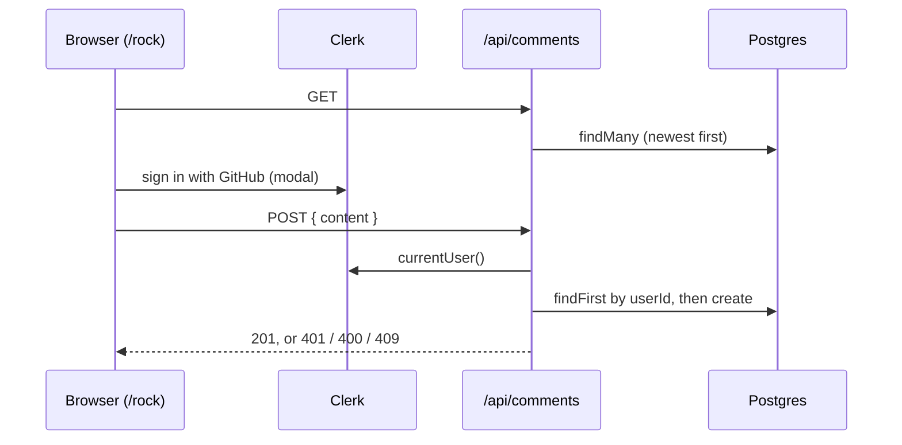

# Guestbook

The `/rock` easter egg page: a rotating 3D rock and a guestbook where each GitHub user can leave one short message.

## Why

It is the site's only dynamic, user-generated feature, and the reason the site has auth and a database at all.
Limiting it to one 25-character message per GitHub account keeps moderation trivial.

## How it works

- `/rock` is a client page: it fetches comments on mount and shows the form only to a signed-in user who has not posted yet.
- `POST` requires a Clerk session (401), trims and caps content at 25 characters (400), and rejects a second comment from the same user (409).
- The stored name is the GitHub username, falling back to first name, then `anonymous`; the avatar is Clerk's `imageUrl`.
- `proxy.ts` runs `clerkMiddleware()` on every non-static route and always on `/api`.
- The rock is a Three.js scene loaded with `next/dynamic` and `ssr: false`.

## Tech

- Clerk (`@clerk/nextjs`), GitHub as the only sign-in provider
- Prisma + PostgreSQL (`Comment` model)
- Three.js via `@react-three/fiber` and `@react-three/drei`

## Key files

- `app/rock/page.tsx` - rock, guestbook UI, sign-in / sign-out
- `app/api/comments/route.ts` - `GET` and `POST`, `force-dynamic`
- `components/RotatingRock.tsx` - 3D canvas
- `proxy.ts` - Clerk middleware and matcher
- `prisma/schema.prisma` - `Comment` model
- `next.config.mjs` - allows avatar images from `avatars.githubusercontent.com` and `img.clerk.com`

## Decisions and gotchas

- `userId` is `@unique` in the schema, so the one-comment rule holds even if the API check races.
- The 25-character limit is defined twice (`CHAR_LIMIT` in the page and the route); change both.
- Env: `NEXT_PUBLIC_CLERK_PUBLISHABLE_KEY`, `CLERK_SECRET_KEY` (see `.env.example`).
- Previews use Clerk's development instance and production its production instance, so a preview can never mint a production session.
- Clerk keys are read at build time: after changing them in Vercel, redeploy.
  The smoke test reports this case explicitly.
- `proxy.ts` is the Next.js middleware entrypoint under its current name; there is no `middleware.ts`.

## Related

- [Database](database.md)
- [CI/CD](ci-cd.md)
