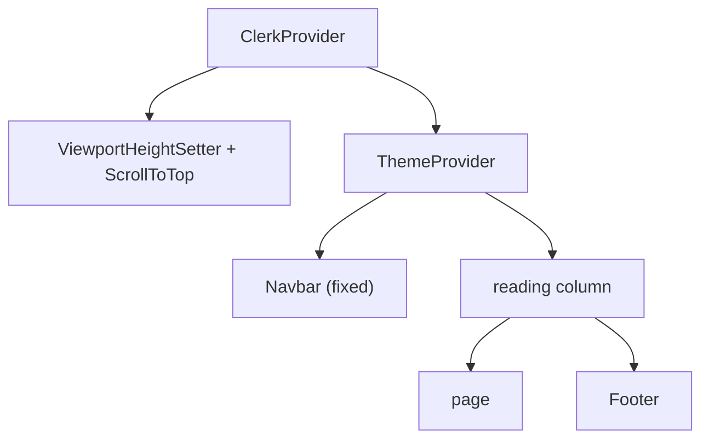

# Layout and navigation

The root layout wraps every page in auth and theme providers, a fixed navbar, a centred reading column, and a footer.

## Why

Every page shares one frame, so pages only render their own content.
A few pages (`/rock`, `/random`, `/reach-out`) fill the viewport exactly and need the frame to step aside.

## How it works

- `app/layout.tsx` sets site metadata, fonts, and providers.
- `metadataBase` is `https://henryvendittelli.com`, so `opengraph-image.png` and `twitter-image.png` resolve to absolute URLs.
- Project pages generate their own share card (`app/projects/[slug]/opengraph-image.tsx`, with `twitter-image.tsx` serving the same image): the home card's frame and dashed rule, the project's preview image in place of the wordmark, and `henryvendittelli.com/projects/<slug>` in place of the nav row. Cards are prerendered at build time, one per project.
- Pages set their own `title` and `description`; detail routes use `generateMetadata`. Project pages also set their own `openGraph` and `twitter` blocks.

### Navbar

- Fixed header with a progressive blur: stacked backdrop-filter layers masked from strong to none.
- Hovering a link dims its siblings (`.nav-links:hover .nav-link:not(:hover)`).
- Below `md` it becomes a fullscreen menu.
- Nav items come from `navItems` in `data/index.ts`.

### Footer

- Socials, wordmark, and resume / email / reach-out links; contact details come from `contact` in `data/index.ts`.
- Hidden on `HIDDEN_ROUTES` (`/rock`, `/random`, `/reach-out`), which are sized to the viewport.

### /random canvas

- `TabsContainer` lays out draggable `CollapsibleTab` windows (setup, software, hobbies, and so on).
- `ZIndexProvider` brings the last-touched window to the front.
- Each window starts in a shuffled cell of a 3x2 grid with a little jitter, computed in a layout effect so cards are placed before first paint.
- On small screens the windows stack instead of floating.

## Tech

- `react-draggable` for the `/random` windows
- `next/navigation` `usePathname`
- CSS `backdrop-filter` and mask images for the blur

## Key files

- `app/layout.tsx` - providers, metadata, column widths
- `lib/og.tsx` - `OgFrame` and fonts for generated share cards, measured from `app/opengraph-image.png`
- `app/projects/[slug]/opengraph-image.tsx` - per-project share card
- `components/Navbar.tsx` - header, theme toggle, mobile menu
- `components/Footer.tsx` - footer and hidden routes
- `components/ViewportHeightSetter.tsx` - sets `--vh` from `window.innerHeight`
- `components/ScrollToTop.tsx` - scrolls to top on route change
- `components/TabsContainer.tsx`, `components/CollapsibleTab.tsx` - `/random` canvas
- `hooks/useMediaQuery.ts` - client media query hook

## Decisions and gotchas

- `--vh` exists because mobile browsers change `100vh` as toolbars show and hide; full-height pages use `calc(var(--vh) * 100)`.
- The footer is a client component because it reads the pathname; a server footer would also freeze the copyright year at build time.
- Adding a full-viewport page means adding it to `HIDDEN_ROUTES`, or the footer forces a scrollbar.
- A route that sets no `openGraph` inherits the root layout's, including `url: "/"`, so its shared links show the home title and URL. Project pages set their own for that reason; blog posts still inherit.
- Share cards are drawn by satori (`next/og`), which needs static `woff` fonts (from `@fontsource/oswald` and `@fontsource/inter`, not the site's `next/font` files), `display: flex` on any element with more than one child, and images as data URLs. Dashes are a repeating gradient because satori shrinks fixed-width children of an overflowing row.
- The home card stays a static PNG; `lib/og.tsx` reproduces its layout to within a few pixels, so a redesign of one should update the other.

## Related

- [Styling and theme](styling-and-theme.md)
- [Guestbook](guestbook.md)
