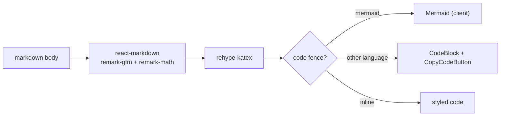

# Markdown rendering

`BlogContent` turns a project or post body into HTML, with GFM, LaTeX, syntax-highlighted code, and Mermaid diagrams.

## Why

Writeups explain systems, so they need diagrams, formulas, tables, and code, not just prose.
Rendering on the server keeps the markdown and highlighting libraries out of the client bundle.

## How it works

- `BlogContent` is a server component; only `CopyCodeButton` and `Mermaid` run on the client.
- Fenced code gets a language header, Prism highlighting with a fixed dark theme, and a copy button.
- A fence tagged `mermaid` renders as a diagram instead of source.
- `$...$` and `$$...$$` render through KaTeX.
- Links starting with `http` open in a new tab and get a trailing `PiArrowSquareOut` icon (plus screen-reader text); relative links stay plain.
- Typography comes from `@tailwindcss/typography` (`prose`), with overrides in `app/globals.css`.

### Mermaid

- Mermaid (~3MB) is dynamically imported inside an effect, so it never lands in the server bundle or the initial client chunk.
- It waits for `next-themes` to resolve, then renders with a palette that mirrors the site tokens.
- Diagrams re-render when the theme flips.
- Invalid diagram source is shown as-is instead of failing silently.

## Tech

- `react-markdown`, `remark-gfm`, `remark-math`, `rehype-katex`, `katex`
- `react-syntax-highlighter` (Prism)
- `mermaid`

## Key files

- `components/BlogContent.tsx` - markdown pipeline and element overrides
- `components/CopyCodeButton.tsx` - client copy button for code blocks
- `components/Mermaid.tsx` - client diagram renderer and theme palettes
- `app/globals.css` - `.prose`, KaTeX, and `.mermaid-diagram` overrides

## Decisions and gotchas

- Code block colours are `--code-*` CSS variables in `app/globals.css`, with a dark and a light set; `codeTheme` in `BlogContent.tsx` only maps Prism tokens to them, so the palette swaps with `data-theme` before hydration.
- Inline code uses `bg-foreground/90 text-background`, which inverts per theme (dark chip on light, light chip on dark).
- Mermaid palettes are hard-coded hex values; update them with the tokens in `globals.css`.
- Quote Mermaid node labels (`A["text"]`) so punctuation and parentheses parse; use ` ` for line breaks.
- Mermaid runs with `securityLevel: "strict"`.
- Renders go through a module-level queue, each with a fresh id.
  Mermaid has one global config and a scratch element per render, so overlapping renders (StrictMode's double effect after a client-side navigation) broke each other and fell back to raw source.

## Related

- [Content system](content-system.md)
- [Styling and theme](styling-and-theme.md)
