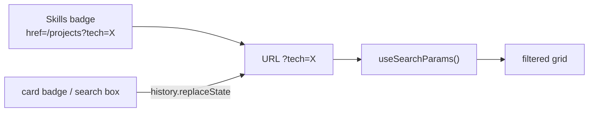

# Tech badges and filter

Technology names render as icon badges, and `/projects` filters its grid by one technology held in the `?tech=` query param.

## Why

Skills on the home page and badges on project cards link to "every project that used this", so the filter has to be shareable as a URL.
Keeping the filter client-side lets `/projects` stay a static, prerendered page.

## How it works

- `app/projects/page.tsx` passes every project (as `ProjectSummary`) to `ProjectsIndex`; it never reads `searchParams`, so the route is static.
- `ProjectsIndex` wraps the URL-reading part in `Suspense`.
  The prerendered HTML is the unfiltered grid; the filter applies after hydration.
- Changing the filter calls `window.history.replaceState`.
  Next keeps `useSearchParams` in sync without a server round trip.
- The search box lists every technology used by any project, with counts, and selects one.
- Card badges toggle the filter; a selected badge renders inverted.
- `TechBadgeRows` shows the first two rows of badges on a card and collapses the rest into a `+N` chip.

### Icon registry

- `techIcons` in `components/TechBadge.tsx` maps a technology name to a `react-icons` icon.
- Unknown names fall back to a generic code glyph (`getTechIcon`), so a missing icon never breaks a page.
- Adding an icon is one import plus one map entry; prefer an existing key's spelling (`Next.js`, not `NextJS`).
- `TechBadge` renders as a link (`href`), a toggle button (`onClick`), or a plain span.

## Tech

- `next/navigation` `useSearchParams`
- `react-icons` (Simple Icons for brands, Phosphor as fallback)
- `ResizeObserver` for badge row measurement

## Key files

- `lib/techFilter.ts` - `parseTechFilter` and `buildTechQuery`
- `components/ProjectsIndex.tsx` - search, URL sync, filtered grid
- `components/TechBadge.tsx` - icon registry and badge
- `components/TechBadgeRows.tsx` - two-row clamp with `+N` overflow chip
- `components/Skills.tsx` - home page skill badges linking into the filter
- `components/ProjectCard.tsx` - project card on the index

## Decisions and gotchas

- A direct visit to `/projects?tech=X` briefly shows every project before the filter applies; that is the cost of a static page.
- Only one technology filters at a time.
  Old links with a comma-separated list use the first entry.
- Always build filter URLs with `buildTechQuery` so encoding stays consistent.
- `TechBadgeRows` measures rendered rows, because how many badges fit depends on text and card width.
  A CSS max-height clamp keeps the first paint correct before measurement.
- Badge order in a project's `technologies` decides which badges are visible on its card.

## Related

- [Content system](content-system.md)
